<div align="center">

# 🍽️ Syrup

**A full-stack restaurant ordering system.**
Browse a menu, place an order on a map, and run the kitchen from a dashboard.

[**▶ Open the live demo**](https://syrup-restaurant.vercel.app)


</div>

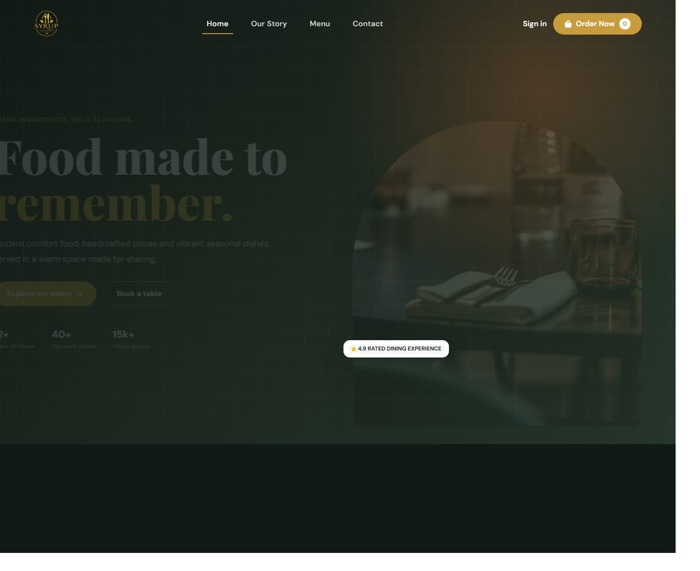

---

## Try it

The demo runs entirely in your browser — no server, no sign-up, nothing leaves your machine.
Order something first, then sign in and watch it land on the kitchen board.

| | |
|---|---|
| 🔗 **Site** | <https://syrup-restaurant.vercel.app> |
| 🔑 **Dashboard** | <https://syrup-restaurant.vercel.app/login> |
| 📧 **Email** | `admin@syrup.local` |
| 🔒 **Password** | `demo1234` |

> The banner in the corner explains the demo and resets it whenever you like.
> A real deployment runs the Express API in `server/` against MySQL; the browser
> backend exists only so the public link is worth clicking.

---

## What it does

### For the guest

| | |
|---|---|
| 🍕 **Menu** | Live from the database, filtered by category |
| 🛒 **Basket** | Slides over the page so browsing is never interrupted · survives a reload · syncs across tabs |
| 🛵 **Delivery or pick-up** | Fee and wait time change with the choice |
| 🗺️ **Map** | Drag the pin to your door, or share your location |
| 💳 **Payment** | Cash on delivery, or a card form with live formatting and Luhn checks |
| ⏰ **Timing** | As soon as possible, or a scheduled slot |
| 🧾 **Confirmation** | Order reference, status track, itemised total |
| 👤 **Account** | Order history and one-click reorder — never required to order |

### For the restaurant

| | |
|---|---|
| 📋 **Kitchen board** | Every order with items, notes, phone and address · one tap to advance |
| 🍽️ **Menu management** | Add, edit, hide or show a dish — live on the site immediately |
| ⚙️ **Settings** | Delivery fee, minimum order, wait times, and a switch that pauses ordering |
| ✉️ **Messages** | Enquiries from the contact page, with unread filtering |

---

## Screens

<table>
<tr>
<td width="50%">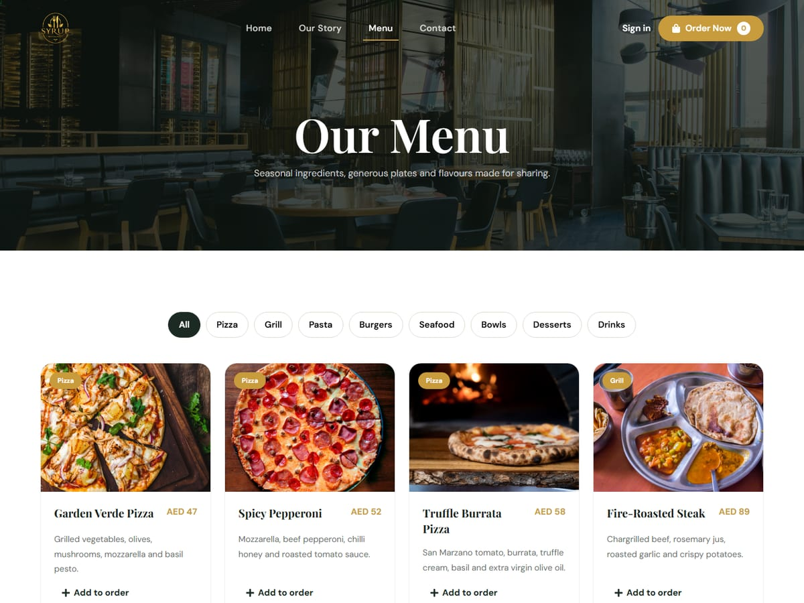<br><sub><b>Menu</b> — filters, skeletons while loading</sub></td>
<td width="50%">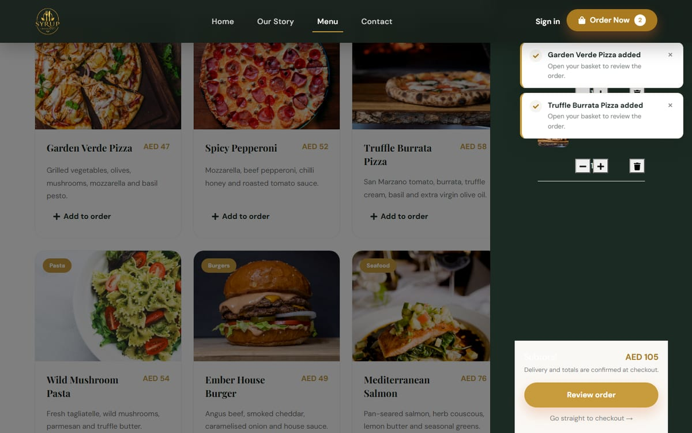<br><sub><b>Basket drawer</b> — opens over the page</sub></td>
</tr>
<tr>
<td colspan="2">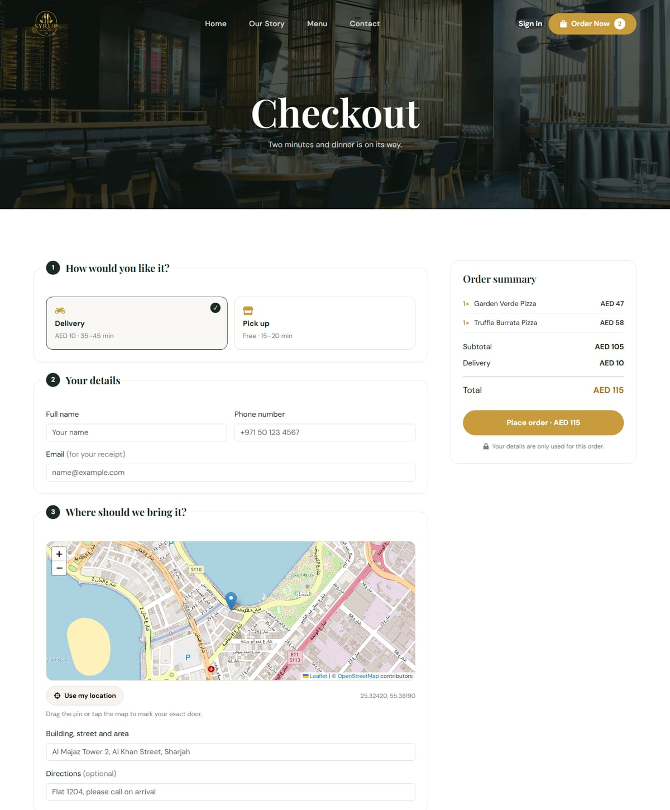<br><sub><b>Checkout</b> — fulfilment, details, map, timing, payment, and a summary that recalculates as you change them</sub></td>
</tr>
<tr>
<td width="50%">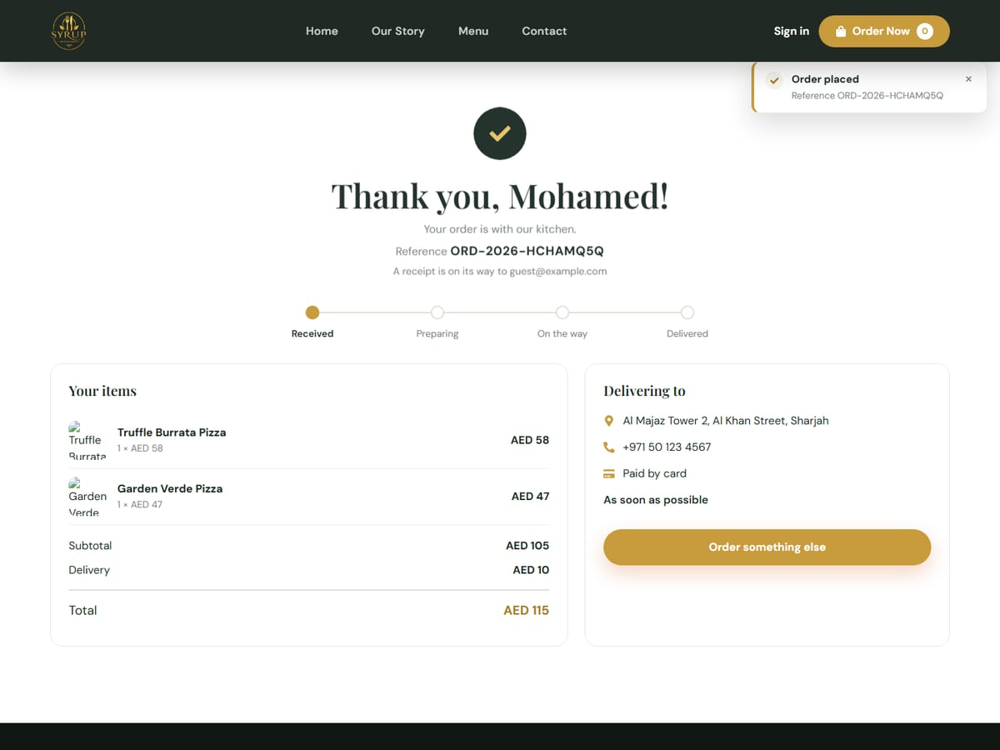<br><sub><b>Confirmation</b> — reference and status track</sub></td>
<td width="50%">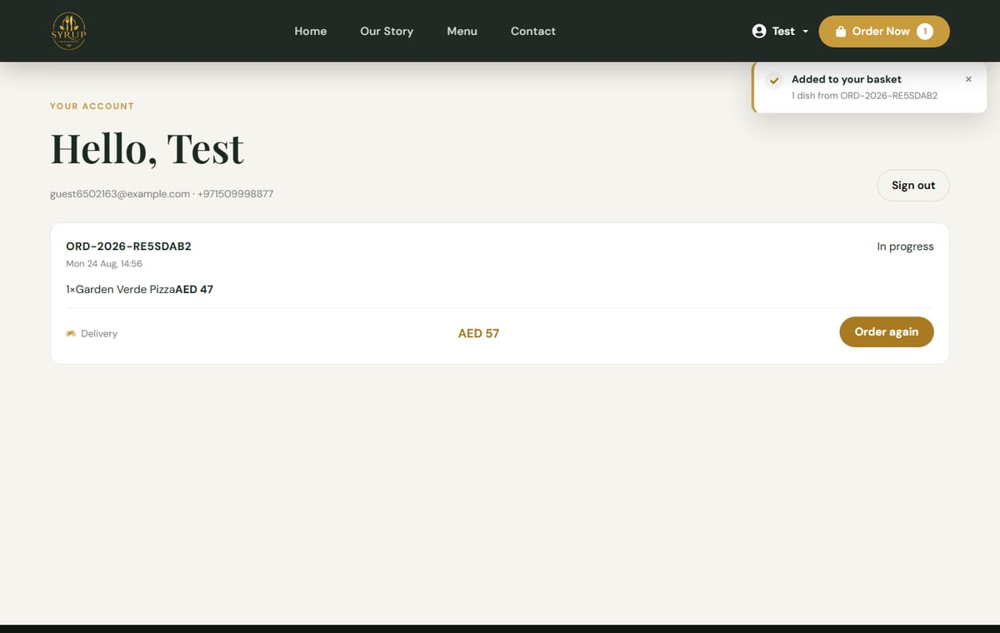<br><sub><b>Account</b> — history and reorder</sub></td>
</tr>
</table>

### Dashboard

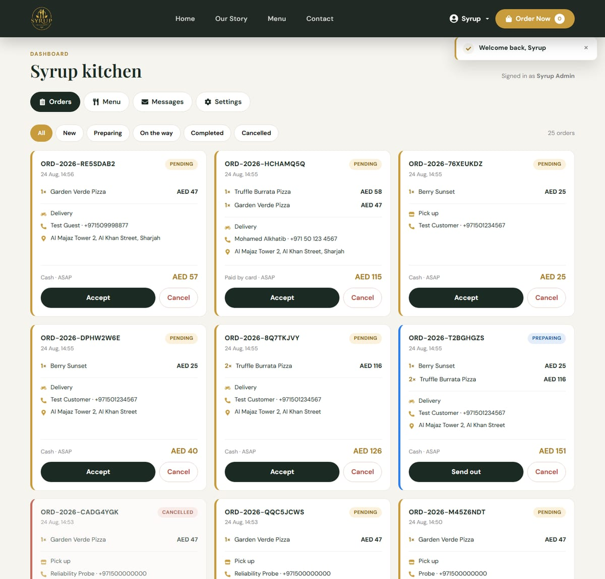
<sub><b>Kitchen board</b> — built for a tablet: large targets, high contrast, one action per order</sub>

<table>
<tr>
<td width="50%">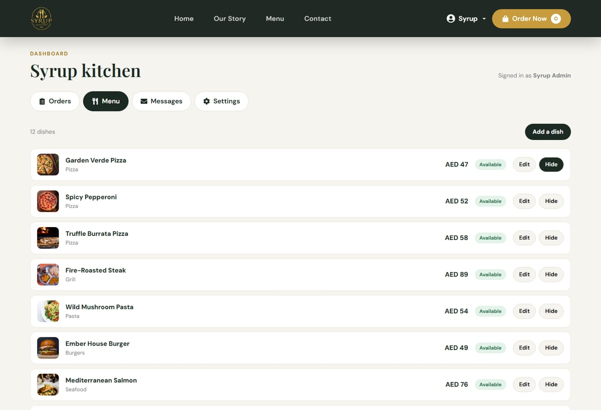<br><sub><b>Menu management</b></sub></td>
<td width="50%">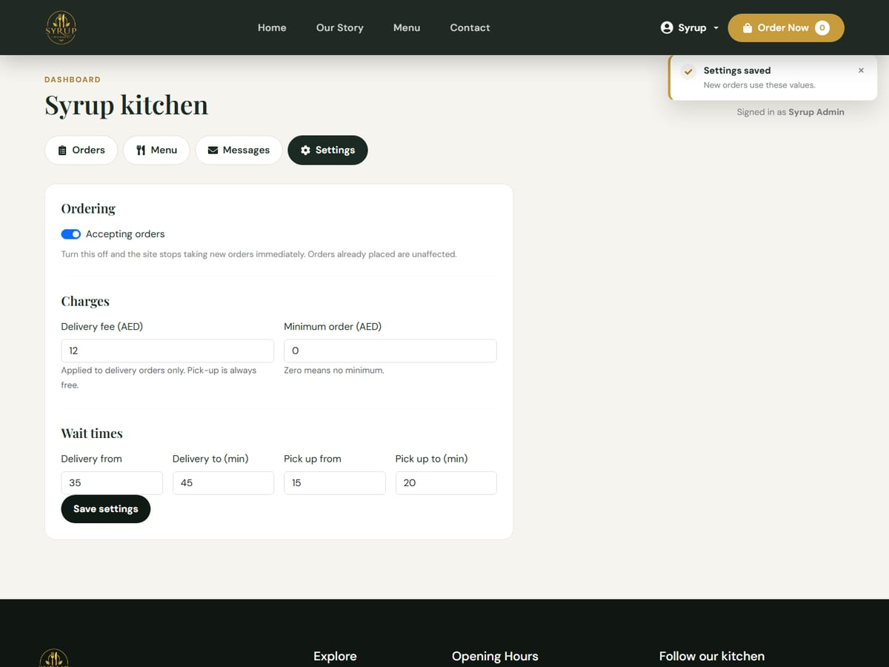<br><sub><b>Settings</b> — the delivery fee the owner controls</sub></td>
</tr>
</table>

### Mobile

<table>
<tr>
<td>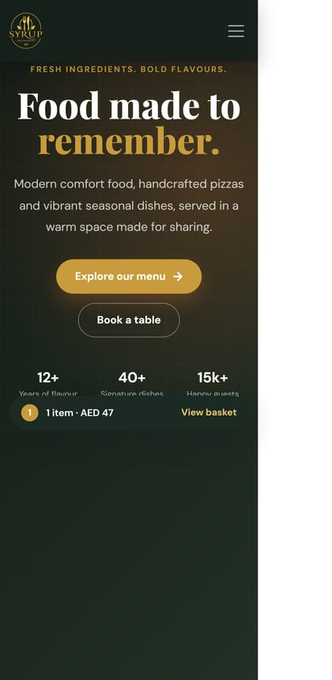</td>
<td>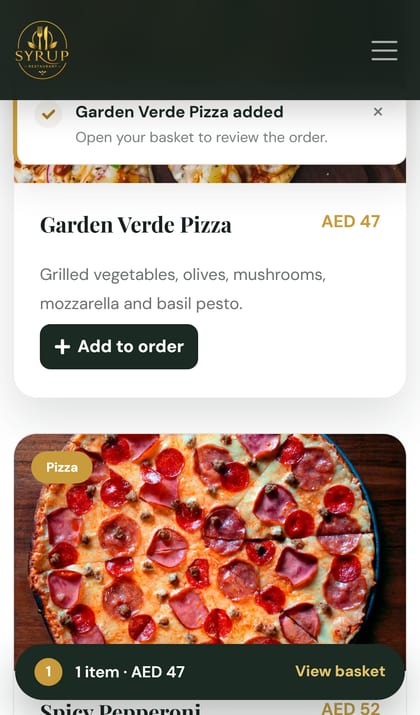</td>
</tr>
</table>

---

## Stack

| Layer | Choice | Why |
|---|---|---|
| **Frontend** | React 19 · Vite 7 · React Router 7 | Fast builds, route-level code splitting |
| **UI** | React Bootstrap 5 · custom CSS | Small design system on CSS variables |
| **Map** | Leaflet · OpenStreetMap | Free and open — no API key, no account |
| **Backend** | Node 22 · Express 5 · TypeScript | One language across the stack; Express 5 forwards async errors on its own |
| **Validation** | Zod | One schema per endpoint, checked before any logic runs |
| **ORM** | Prisma 6 | Typed queries, real migrations, parameterised by default |
| **Database** | MySQL 8.4 · InnoDB | Orders and their items are relational; money is `DECIMAL`, never a float |
| **Auth** | JWT + rotating refresh tokens · scrypt | No native build step, which matters on Windows |
| **Quality** | ESLint · Prettier · `tsc` · Playwright | Clean on every commit |

---

## Architecture

```
Browser
  │
  ├─ React SPA — one lazy-loaded chunk per route
  │    Pages → useResource (loading · error · retry)
  │            → src/api/*  (menu · orders · auth · settings · contact)
  │              → client.js ── the only place that calls fetch
  │                 owns the base URL, the auth header, the response
  │                 shape, and one shared refresh on 401
  │
  │  HTTPS · Bearer access token · HttpOnly refresh cookie
  ▼
Express 5
  helmet → CORS allow-list → json(100kb) → cookies → pino → rate limit
     → route → Zod → auth guard → business logic → Prisma → MySQL
     → error middleware — every failure gets the same shape
```

**Three rules the code is built around:**

1. **The server owns every price.** `POST /api/orders` accepts `menuItemId` and
   `quantity` and nothing else. There is no price field in the schema to forge.
   Totals are read from the database inside a transaction.
2. **Order references are random, not sequential.** A guest order is fetched by
   its reference alone, so `ORD-2026-0002` would have let anyone read the next
   customer's name, phone and address.
3. **The frontend guard is a convenience, not the lock.** Hiding a button hides
   nothing. Every admin endpoint checks the role itself and answers `403`.

---

## Project structure

```
syrup-restaurant/
│
├── src/                          # React frontend
│   ├── api/                      # the only layer that talks to the server
│   │   ├── client.js             #   fetch wrapper · auth header · token refresh
│   │   ├── menu.js  orders.js    #   one module per resource
│   │   ├── auth.js  contact.js
│   │   ├── settings.js
│   │   ├── payments.js           #   card validation (Luhn, expiry, brand)
│   │   └── demo-backend.js       #   browser-only API for the public demo
│   │
│   ├── components/
│   │   ├── Navbar.jsx  Footer.jsx  MenuCard.jsx
│   │   ├── CartDrawer.jsx  MobileCartBar.jsx
│   │   ├── AddressMap.jsx        #   Leaflet picker
│   │   ├── AccountMenu.jsx  ProtectedRoute.jsx
│   │   ├── DataState.jsx         #   loading · error · empty, in one place
│   │   ├── ToastStack.jsx  RouteFallback.jsx  ScrollToTop.jsx
│   │   └── MenuCardSkeleton.jsx  DemoBanner.jsx
│   │
│   ├── context/                  # cart · cart UI · toasts · auth
│   ├── hooks/                    # useCart · useAuth · useToast · useResource
│   ├── pages/
│   │   ├── Home  Menu  Story  Contact  NotFound
│   │   ├── Cart  Checkout  OrderConfirmation
│   │   ├── Login  Register
│   │   ├── account/MyOrders.jsx
│   │   └── admin/                #   layout · orders · menu · messages · settings
│   ├── pages.css/                # one stylesheet per page or component
│   ├── utils/currency.js         # every price formatted in one place
│   └── assets/                   # WebP images · self-hosted fonts
│
├── server/                       # Express + TypeScript API
│   ├── prisma/
│   │   ├── schema.prisma         #   8 tables
│   │   ├── migrations/
│   │   └── seed.ts               #   categories · dishes · settings · admin
│   ├── src/
│   │   ├── env.ts                #   Zod-checked environment, fails fast
│   │   ├── app.ts  index.ts
│   │   ├── lib/                  #   errors · jwt · password · money · logger
│   │   ├── middleware/           #   validate · auth (RBAC) · error
│   │   └── routes/               #   menu · orders · auth · contact · settings
│   └── scripts/smoke.mjs         #   33 API checks against a real database
│
├── scripts/
│   ├── verify-site.mjs           # public pages, in a real browser
│   ├── verify-admin.mjs          # auth and dashboard, 23 checks
│   ├── verify-demo.mjs           # the public demo, 8 checks
│   └── optimize-images.mjs       # reproducible WebP pipeline
│
├── docs/images/                  # screenshots used above
└── vercel.json                   # SPA rewrite · security headers · demo flag
```

---

## Running it locally

### Requirements

- Node.js 22+
- MySQL 8 (or MariaDB 10.5+)

### 1 · Database

```bash
mysql -u root -p -e "CREATE DATABASE syrup CHARACTER SET utf8mb4 COLLATE utf8mb4_0900_ai_ci;"
```

### 2 · API

```bash
cd server
npm install
cp .env.example .env          # then fill DATABASE_URL and the two JWT secrets
npx prisma migrate deploy
npm run seed                  # 8 categories, 12 dishes, settings, an admin
npm run dev                   # http://localhost:4000
```

Generate the secrets with:

```bash
node -e "console.log(require('crypto').randomBytes(48).toString('base64url'))"
```

### 3 · Frontend

```bash
npm install
cp .env.example .env          # VITE_API_URL=http://localhost:4000/api
npm run dev                   # http://localhost:5173
```

The seed prints the admin credentials it created. **Change them before going anywhere near production.**

---

## API

Every response is `{ data }` on success and `{ error: { code, message, details? } }` on failure.

| Method | Endpoint | Purpose | Access |
|---|---|---|---|
| `GET` | `/api/health` | Service and database status | Public |
| `GET` | `/api/settings` | Delivery fee, wait times, ordering switch | Public |
| `PATCH` | `/api/settings` | Update them | **Admin** |
| `GET` | `/api/categories` | Categories with item counts | Public |
| `GET` | `/api/menu-items` | Menu · `?category=` | Public |
| `GET` | `/api/menu-items/:idOrSlug` | One dish | Public |
| `POST` | `/api/menu-items` | Add a dish | **Admin** |
| `PATCH` | `/api/menu-items/:id` | Edit a dish | **Admin** |
| `DELETE` | `/api/menu-items/:id` | Archive a dish | **Admin** |
| `POST` | `/api/orders` | Place an order — **server prices it** | Public |
| `GET` | `/api/orders/:reference` | One order | Owner or admin |
| `GET` | `/api/orders/me` | My orders | Signed in |
| `GET` | `/api/orders` | All orders · `?status=&page=` | **Admin** |
| `PATCH` | `/api/orders/:reference/status` | Advance an order | **Admin** |
| `POST` | `/api/contact-messages` | Send an enquiry · 5/hour | Public |
| `GET` | `/api/contact-messages` | Read enquiries | **Admin** |
| `PATCH` | `/api/contact-messages/:id` | Mark read | **Admin** |
| `POST` | `/api/auth/register` · `login` | 10 attempts / 15 min | Public |
| `POST` | `/api/auth/refresh` · `logout` | Session | Cookie |
| `GET` | `/api/auth/me` | Current user | Signed in |

---

## Database

```
users ──< orders ──< order_items >── menu_items >── categories
  └──< refresh_tokens                                    

contact_messages          settings (one row)
```

| Table | Holds | Notes |
|---|---|---|
| `users` | Account, role, scrypt hash | Email unique, case-insensitive by collation |
| `refresh_tokens` | SHA-256 hash, expiry, revocation | Rotated on every use |
| `categories` | Name, slug, display order | |
| `menu_items` | Name, price, description, image, availability | `RESTRICT` on category delete |
| `orders` | Customer, fulfilment, address, coordinates, totals, status | `SET NULL` on user delete — the order survives |
| `order_items` | **Name and unit price captured at order time** | Editing the menu never rewrites old invoices |
| `contact_messages` | Enquiry with a typed subject | |
| `settings` | Delivery fee, minimum, wait times, ordering switch | The row the dashboard edits |

Money is `DECIMAL(10,2)` everywhere. Timestamps are `DATETIME(3)` stored in UTC,
since MySQL has no timezone-aware type.

---

## Testing

Seventy automated checks run against a real database and a real browser.

```bash
cd server && npm run smoke      # 33 · API behaviour and security
npm run verify                  # public pages · console errors · overflow
npm run verify:admin            # 23 · auth, RBAC, dashboard
npm run verify:demo             #  8 · the public demo
```

They assert the things reading the code cannot prove — that a request sending
`price: 0` is still charged in full, that a customer gets `403` on every admin
route, that one customer cannot read another's order, that the refresh cookie is
`HttpOnly` and `SameSite=Strict`, and that a wrong password and an unknown email
return identical errors.

```bash
npm run lint          # ESLint, frontend
npm run format:check  # Prettier
cd server && npm run typecheck
```

---

## Roadmap

Honest about what is not there yet.

- [ ] Idempotency keys — a double click currently creates two orders
- [ ] An order state machine — any status transition is allowed today
- [ ] Password reset and transactional email
- [ ] New-order alert on the kitchen board
- [ ] VAT
- [ ] Unit tests and CI
- [ ] A real payment gateway (the card form is validated but not charged)
- [ ] Multi-branch support

---

## Scripts

| Command | What it does |
|---|---|
| `npm run dev` | Vite dev server |
| `npm run build` | Production build |
| `npm run lint` · `lint:fix` | ESLint |
| `npm run format` · `format:check` | Prettier |
| `npm run verify` · `verify:admin` · `verify:demo` | Browser checks |
| `npm run optimize:images` | Rebuild the WebP assets |
| `server` → `npm run dev` | API with reload |
| `server` → `npm run seed` | Seed the database |
| `server` → `npm run smoke` | API checks |
| `server` → `npm run db:reset` | Drop, migrate, reseed |

---

## Contributors

<div align="center">

**Mohamed Alkhatib**

[](https://github.com/mohamedAlkhatib5)

</div>

---

## License

MIT © Mohamed Alkhatib
